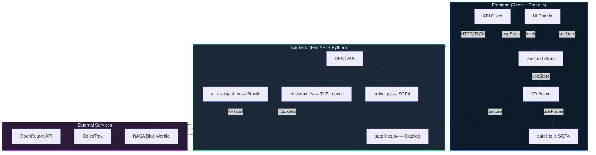
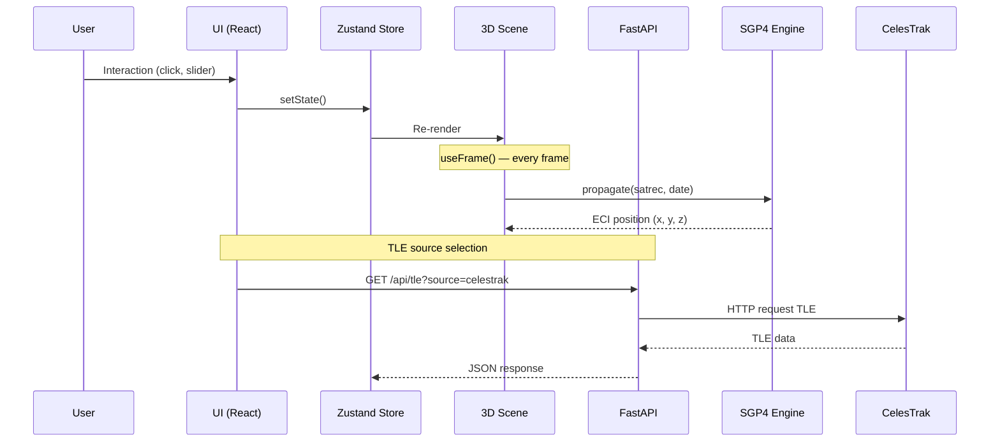
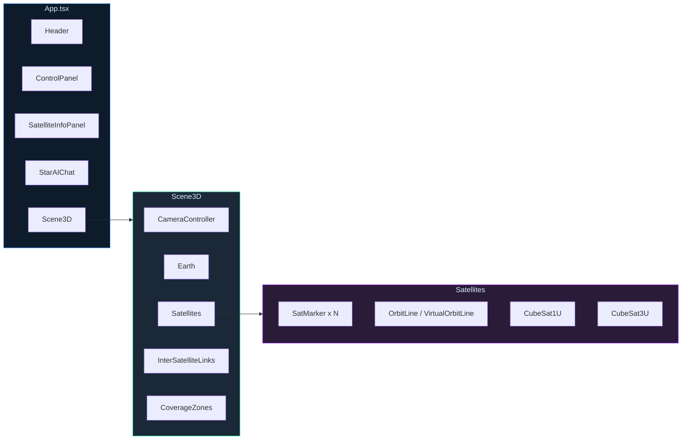
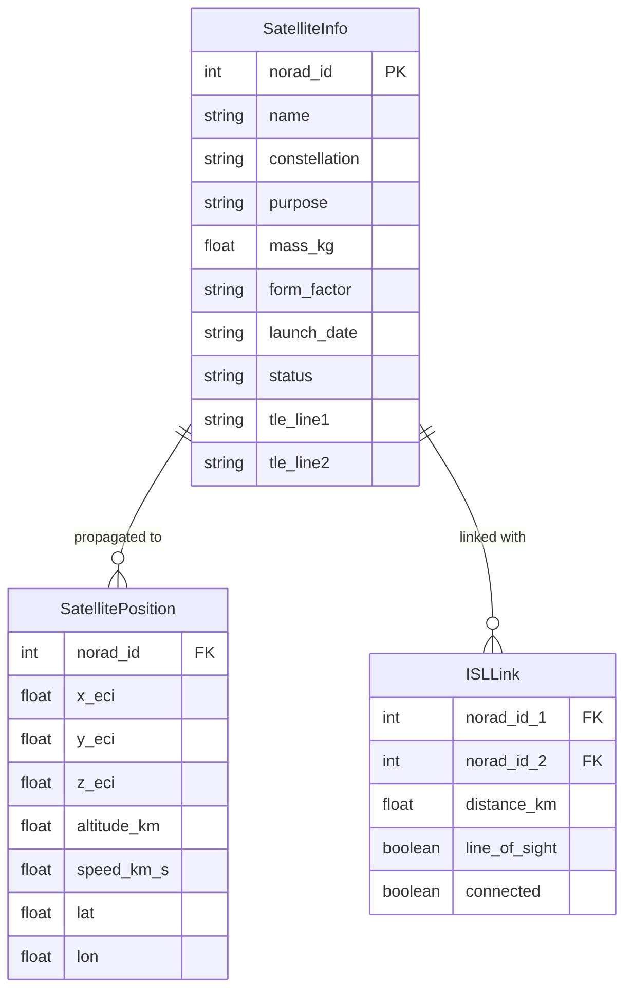
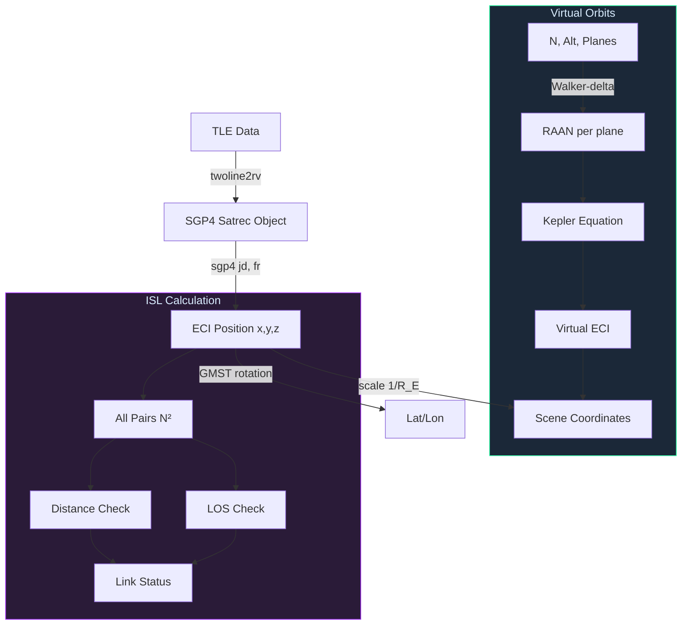

# Architecture / Архитектура

> [RU](#архитектура-ru) | [EN](#architecture-en)

---

## Architecture (EN)

### System Overview

StarVision follows a classic **client-server** architecture with a clear separation of concerns:

- **Frontend** (React + Three.js) — handles all 3D rendering, client-side SGP4 propagation, and UI state management
- **Backend** (Python FastAPI) — serves the satellite catalog, orbital computations, TLE data loading, and AI assistant
- **External Services** — CelesTrak (TLE data), OpenRouter API (StarAI), NASA (Earth textures)



### Data Flow



### Component Hierarchy



### Data Model



### Orbital Mechanics Pipeline



### Key Architectural Decisions

| Decision | Rationale |
|---|---|
| **Client-side SGP4** (`satellite.js`) | Smooth per-frame animation without network latency; backend SGP4 used as fallback |
| **Shared `simClock`** | Single time source for synchronizing camera, satellites, and ISL calculations |
| **Zustand** for state | Lightweight, no boilerplate, selective re-renders via subscriptions |
| **Virtual Walker orbits** | When `orbitAltitudeKm > 0`, analytical circular Walker-delta orbits are generated client-side |
| **LOS ray-sphere test** | Geometric Earth-shadow check for ISL visibility — no external physics engine needed |
| **CelesTrak integration** | Auto-load TLE with 1-hour TTL cache + async lock to prevent race conditions; falls back to embedded data |
| **Object pooling** | Reuse Three.js geometries and materials across satellites to reduce GC pressure |
| **Adaptive DPR** | Device pixel ratio adjusted dynamically to maintain target frame rate |

### Directory Structure

```
StarVision/
├── backend/
│   ├── main.py               # FastAPI endpoints (REST API)
│   ├── satellites.py         # Catalog of 15 Russian CubeSats + TLE
│   ├── orbital.py            # SGP4 propagation, ECI → geodetic conversions
│   ├── celestrak.py          # CelesTrak TLE loader + async cache
│   ├── ai_assistant.py       # StarAI — OpenRouter API + offline fallback
│   ├── requirements.txt
│   └── .env.example
├── frontend/
│   └── src/
│       ├── components/
│       │   ├── Scene3D.tsx            # R3F Canvas, CameraController
│       │   ├── Earth.tsx              # NASA Blue Marble + Suspense fallback
│       │   ├── Satellites.tsx         # SGP4, CubeSat models, Walker orbits
│       │   ├── InterSatelliteLinks.tsx # ISL: per-frame, LOS, object pooling
│       │   ├── CoverageZones.tsx      # Ground coverage footprints
│       │   ├── ControlPanel.tsx       # Speed, sliders, toggles, TLE source
│       │   ├── Header.tsx             # UTC clock, status, language toggle
│       │   ├── SatelliteInfoPanel.tsx # Selected satellite telemetry
│       │   └── StarAIChat.tsx         # AI assistant with UI commands
│       ├── hooks/useStore.ts          # Zustand store
│       ├── i18n.ts                    # Multilingual support (RU/EN)
│       ├── services/api.ts            # REST API client
│       ├── simClock.ts                # Shared simulation clock
│       └── types.ts                   # TypeScript interfaces
├── docs/
│   ├── EN.md                 # English documentation
│   └── RU.md                 # Russian documentation
├── ARCHITECTURE.md           # This file
├── ROADMAP.md
└── README.md
```

---

## Архитектура (RU)

### Общая схема системы

StarVision построен по классической **клиент-серверной** архитектуре с чётким разделением ответственности:

- **Фронтенд** (React + Three.js) — 3D-рендеринг, клиентская SGP4-пропагация, управление состоянием UI
- **Бэкенд** (Python FastAPI) — каталог спутников, орбитальные расчёты, загрузка TLE, ИИ-ассистент
- **Внешние сервисы** — CelesTrak (TLE-данные), OpenRouter API (StarAI), NASA (текстуры Земли)

> Mermaid-диаграммы приведены в [английской секции выше](#architecture-en).

### Ключевые архитектурные решения

| Решение | Обоснование |
|---|---|
| **Клиентская SGP4** (`satellite.js`) | Плавная покадровая анимация без сетевой задержки; серверная SGP4 — как резерв |
| **Shared `simClock`** | Единый источник времени для синхронизации камеры, спутников и МСС |
| **Zustand** для состояния | Легковесный, без бойлерплейта, селективные ре-рендеры через подписки |
| **Виртуальные Walker-орбиты** | При `orbitAltitudeKm > 0` генерируются аналитические круговые Walker-delta орбиты на клиенте |
| **LOS ray-sphere тест** | Геометрическая проверка затенения Землёй для видимости МСС — без внешнего физического движка |
| **CelesTrak интеграция** | Автозагрузка TLE с кэшем (TTL 1 час) + asyncio.Lock для предотвращения гонок; fallback на встроенные данные |
| **Пулинг объектов** | Повторное использование Three.js-геометрий и материалов для снижения нагрузки на GC |
| **Адаптивный DPR** | Динамическая настройка device pixel ratio для поддержания целевого FPS |

### Структура директорий

```
StarVision/
├── backend/
│   ├── main.py               # FastAPI эндпоинты (REST API)
│   ├── satellites.py         # Каталог 15 российских КА + TLE
│   ├── orbital.py            # SGP4-пропагация, ECI → геодезические
│   ├── celestrak.py          # Загрузка TLE с CelesTrak + асинхронный кэш
│   ├── ai_assistant.py       # StarAI — OpenRouter API + оффлайн fallback
│   ├── requirements.txt
│   └── .env.example
├── frontend/
│   └── src/
│       ├── components/
│       │   ├── Scene3D.tsx            # R3F Canvas, CameraController
│       │   ├── Earth.tsx              # NASA Blue Marble + Suspense fallback
│       │   ├── Satellites.tsx         # SGP4, модели CubeSat, Walker-орбиты
│       │   ├── InterSatelliteLinks.tsx # МСС: покадрово, LOS, пулинг
│       │   ├── CoverageZones.tsx      # Зоны покрытия
│       │   ├── ControlPanel.tsx       # Скорость, ползунки, переключатели
│       │   ├── Header.tsx             # UTC, статус, переключатель языка
│       │   ├── SatelliteInfoPanel.tsx # Телеметрия выбранного КА
│       │   └── StarAIChat.tsx         # ИИ-ассистент с командами UI
│       ├── hooks/useStore.ts          # Zustand-хранилище
│       ├── i18n.ts                    # Мультиязычность RU/EN
│       ├── services/api.ts            # REST API клиент
│       ├── simClock.ts                # Общие часы симуляции
│       └── types.ts                   # TypeScript-интерфейсы
├── docs/
│   ├── EN.md                 # Документация на английском
│   └── RU.md                 # Документация на русском
├── ARCHITECTURE.md           # Этот файл
├── ROADMAP.md
└── README.md
```
