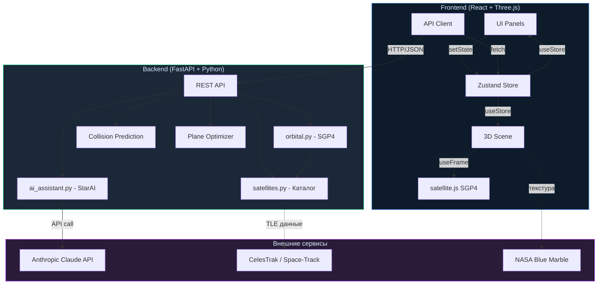
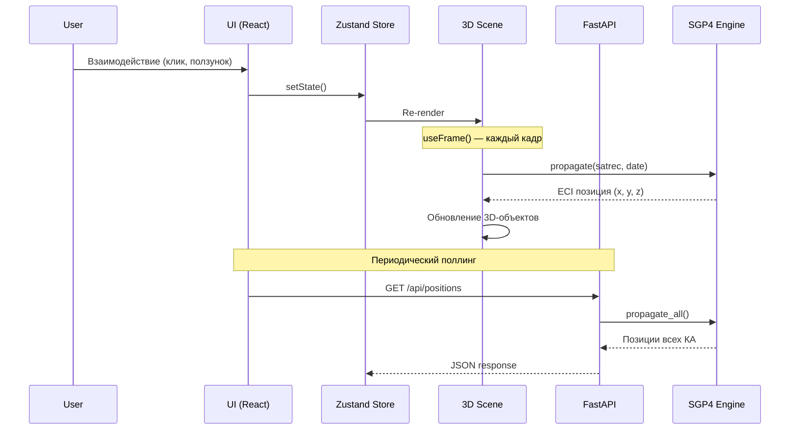
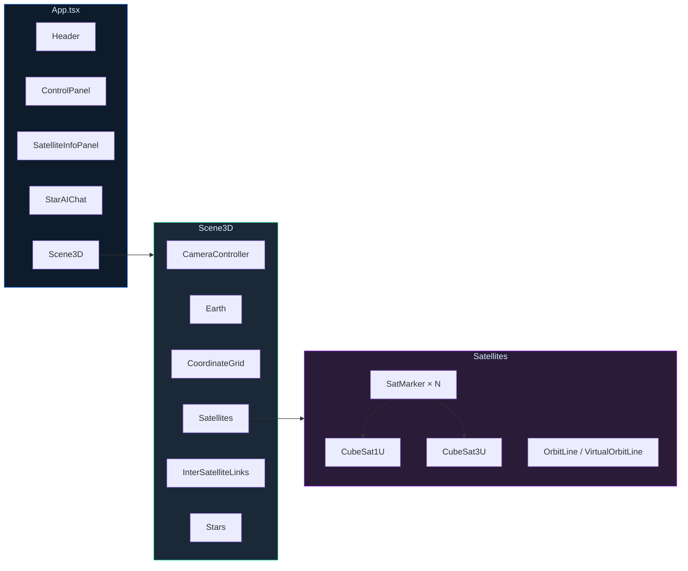
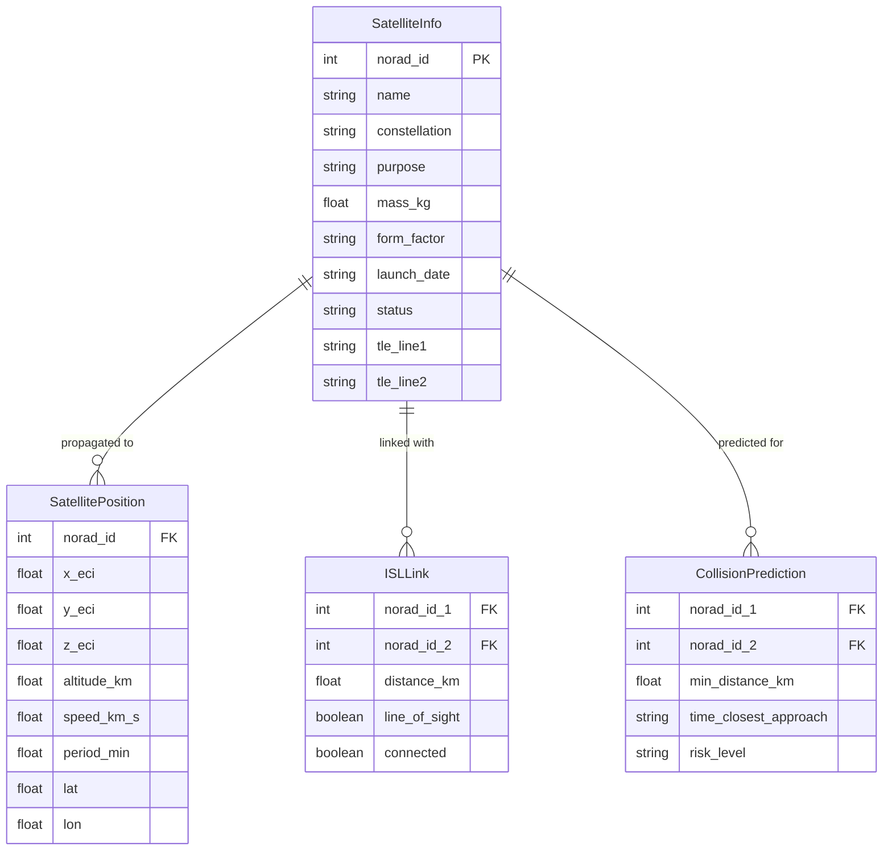
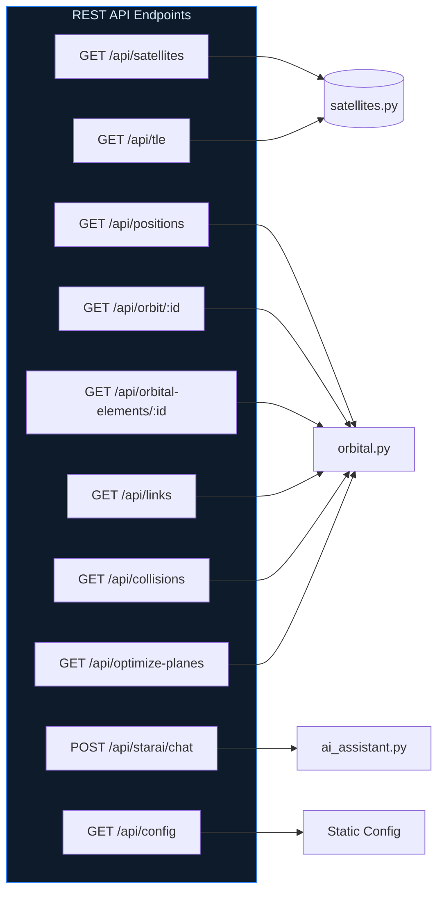

# Архитектура StarVision

> Документация архитектуры цифрового двойника группировки российских кубсатов

## Общая схема системы

## Потоки данных

## Архитектура компонентов

## Модель данных

## Backend API

## Орбитальная механика

## Технологический стек

| Слой | Технология | Назначение |
|------|-----------|------------|
| **Frontend** | React 18 + TypeScript | UI Framework |
| **3D Engine** | Three.js / R3F / Drei | WebGL визуализация |
| **State** | Zustand | Управление состоянием |
| **Styling** | Tailwind CSS | Стилизация |
| **Bundler** | Vite | Сборка и dev-server |
| **Backend** | FastAPI (Python) | REST API |
| **Orbital** | sgp4 (Python) + satellite.js | SGP4 пропагация |
| **AI** | Anthropic Claude API | ИИ-ассистент |

## Принципы оптимизации

1. **Dual SGP4**: клиентская propagation для плавной анимации (60fps), серверная — для точных расчётов
2. **Object Pooling**: пул Line-объектов в InterSatelliteLinks вместо пересоздания каждый кадр
3. **Throttled Raycasting**: проверка наведения на линии каждый 3-й кадр
4. **Gated State Updates**: обновление Zustand только при изменении значений
5. **Uniform Selection**: O(N) выбор спутников вместо сортировки O(N log N)
6. **Shared SimClock**: единый источник времени для всех компонентов
