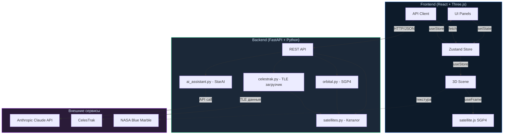
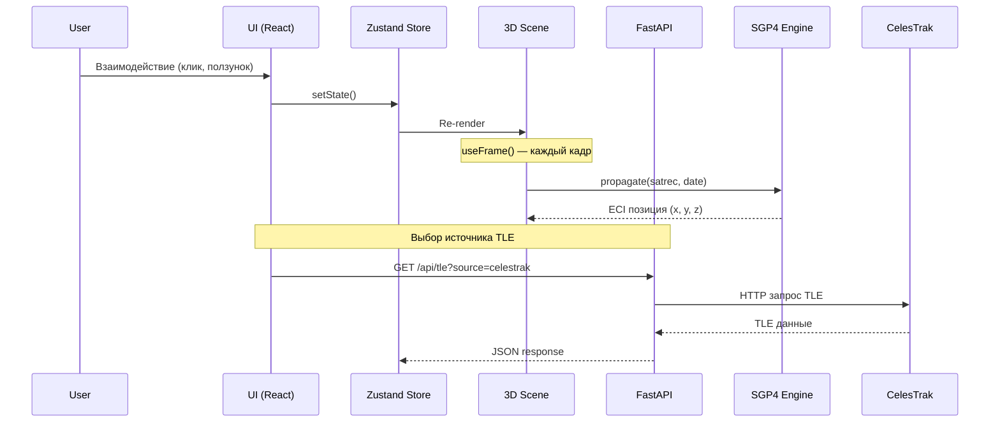
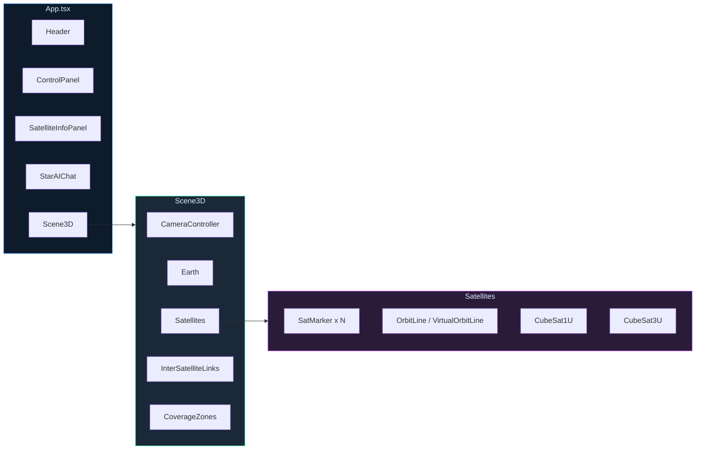
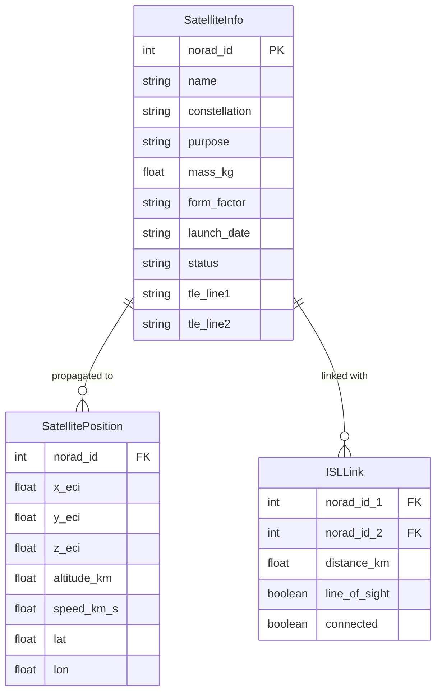
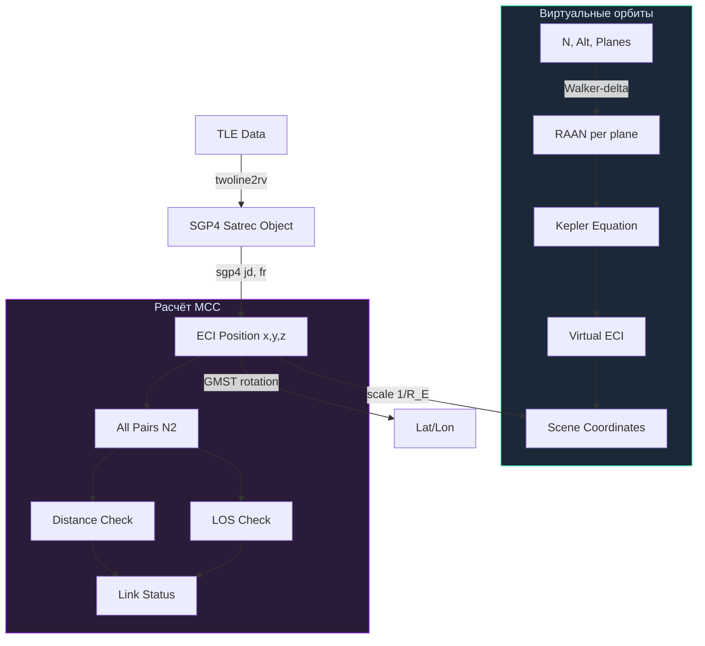

# StarVision v1.2 — Цифровой двойник группировки кубсатов

> **Хакатон: Цифровые двойники космических систем**
> Интерактивный 3D-прототип цифрового двойника группировки CubeSat

---

## О проекте

**StarVision** — цифровой двойник группировки российских кубсатов:
- 3D-визуализация 3–15 спутников на орбите в реальном времени
- Моделирование орбитального движения через SGP4 (`satellite.js` на клиенте)
- Динамические межспутниковые связи (МСС) с проверкой затенения Землёй
- **Автоматическая подгрузка TLE с CelesTrak** с выбором источника данных
- Параметризация: количество КА, высота орбиты, дальность связи
- Мультиязычный интерфейс (русский / английский)
- ИИ-ассистент StarAI на Anthropic Claude API

---

## Возможности

- **15 российских КА** в каталоге: Сфера, Гонец, СириусСат, Декарт, УмКА, Зоркий, Беркут, Аист, Танюша
- **Клиентская SGP4** через `satellite.js` — плавная покадровая анимация
- **Межспутниковые связи (МСС)** — расчёт расстояний и LOS-проверка (затенение Землёй)
- **Источник TLE: встроенные данные или CelesTrak** — переключение в один клик
- **NASA Blue Marble** текстура Земли с Suspense fallback
- **2 модели CubeSat**: 1U (2 панели) и 3U (4 панели) — процедурные Three.js
- **Плавная анимация камеры** (lerp) с режимом слежения за спутником
- **StarAI** — встроенный ИИ-ассистент (Anthropic Claude API) с командами управления
- **Виртуальные Walker-орбиты** — настраиваемая высота (400–2000 км), 1–7 плоскостей
- **Зоны покрытия** — визуализация зоны видимости спутников на поверхности Земли
- **Оптимизированный рендеринг** — пулинг объектов, дросселирование, адаптивный DPR

### Параметры (по ТЗ 3.5)

| Параметр | Диапазон | Описание |
|---|---|---|
| Количество КА | 3–15 | Равномерная выборка из каталога |
| Высота орбиты | TLE / 400–2000 км | TLE = реальные данные; иначе виртуальные Walker-орбиты |
| Источник TLE | Встроенные / CelesTrak | Выбор между демо-данными и актуальными с CelesTrak |
| Дальность связи | 50–10 000 км | Порог видимости МСС |
| Скорость симуляции | 1×–200× | Пресеты ускорения времени |
| МСС линии | вкл/выкл | Показать/скрыть межспутниковые связи |
| Орбитальные треки | вкл/выкл | Показать/скрыть орбиты |
| Подписи КА | вкл/выкл | Показать/скрыть названия спутников |
| Зоны покрытия | вкл/выкл | Визуализация зон видимости спутников на поверхности Земли |
| Фильтр группировок | 7 групп | Выборочное отображение по группировке |
| Язык | RU / EN | Язык интерфейса |

---

## Архитектура

### Общая схема системы



### Потоки данных



### Архитектура компонентов



### Модель данных



### Орбитальная механика



### Ключевые архитектурные решения

- **Клиентская SGP4**: `satellite.js` на фронтенде для плавной покадровой анимации без сетевой задержки
- **Shared simClock**: единый источник времени для синхронизации камеры, спутников и МСС
- **Zustand Store**: легковесное управление состоянием
- **Виртуальные орбиты**: при `orbitAltitudeKm > 0` генерируются аналитические круговые Walker-орбиты
- **LOS-проверка**: геометрический тест луч-сфера для обнаружения затенения Землёй
- **CelesTrak интеграция**: автоматическая подгрузка TLE с кэшированием (1 час TTL) и fallback на встроенные данные

---

## Быстрый старт

### Требования
- **Node.js** >= 18.0, **npm** >= 9.0
- **Python** >= 3.10
- Современный браузер (Chrome 90+, Firefox 90+, Safari 15+)

### Бэкенд

```bash
cd backend
python -m venv venv
source venv/bin/activate
pip install -r requirements.txt
cp .env.example .env           # Добавить ANTHROPIC_API_KEY для StarAI (опционально)
uvicorn main:app --reload --port 8000
```

### Фронтенд

```bash
cd frontend
npm install
npm run dev                    # -> http://localhost:3000
```

Фронтенд автоматически проксирует `/api/*` на `localhost:8000` (настроено в `vite.config.ts`).

---

## Спутники

| Группировка | Спутники | Назначение | Модель |
|---|---|---|---|
| **Сфера** | Скиф-Д, Марафон-IoT-1/2/3 | Интернет, IoT | 3U |
| **Гонец** | Гонец-М №21/22/23 | Персональная спутниковая связь | 3U |
| **Образовательные** | СириусСат-1/2, Танюша-ЮЗГУ-1 | Наука, образование | 1U |
| **МФТИ** | Декарт | Эксперименты МФТИ | 1U |
| **МГТУ им. Баумана** | УмКА-1 | Образовательные проекты | 1U |
| **ДЗЗ** | Зоркий-2М, Беркут-С | Дистанционное зондирование Земли | 3U |
| **Научные** | Аист-2Т | Научные эксперименты | 1U |

---

## Структура проекта

```
StarVision/
├── backend/
│   ├── main.py               # FastAPI эндпоинты
│   ├── satellites.py         # Каталог 15 российских КА + TLE
│   ├── orbital.py            # SGP4-пропагация, ECI → геодезические
│   ├── celestrak.py          # Загрузка TLE с CelesTrak + кэш
│   ├── ai_assistant.py       # StarAI — Claude API + оффлайн fallback
│   ├── requirements.txt
│   └── .env.example
├── frontend/
│   └── src/
│       ├── components/
│       │   ├── Scene3D.tsx            # Canvas (R3F), CameraController
│       │   ├── Earth.tsx              # NASA Blue Marble + Suspense fallback
│       │   ├── Satellites.tsx         # SGP4, 2 модели CubeSat, Walker-орбиты
│       │   ├── InterSatelliteLinks.tsx # МСС: per-frame, LOS, пулинг объектов
│       │   ├── CoverageZones.tsx      # Зоны покрытия
│       │   ├── ControlPanel.tsx       # Скорость, ползунки, переключатели, TLE-источник
│       │   ├── Header.tsx             # UTC, статус, переключатель языка
│       │   ├── SatelliteInfoPanel.tsx # Телеметрия выбранного КА
│       │   └── StarAIChat.tsx         # ИИ-ассистент с командами UI
│       ├── hooks/useStore.ts          # Zustand-хранилище
│       ├── i18n.ts                    # Мультиязычность RU/EN
│       ├── services/api.ts            # REST API клиент
│       ├── simClock.ts                # Общие часы симуляции
│       └── types.ts                   # TypeScript-интерфейсы
├── docs/
│   └── EN.md                 # Документация на английском
├── ROADMAP.md
└── README.md
```

---

## Технологический стек

| Компонент | Технология | Лицензия |
|---|---|---|
| Фронтенд | React 18 + TypeScript | MIT |
| 3D-движок | Three.js / React Three Fiber / Drei | MIT |
| Орбитальная механика (клиент) | satellite.js | MIT |
| UI-фреймворк | Tailwind CSS | MIT |
| Состояние | Zustand | MIT |
| Бэкенд | Python FastAPI | MIT |
| Орбитальная механика (сервер) | python-sgp4 | MIT |
| ИИ-ассистент | Anthropic Claude API | — |
| Сборщик | Vite | MIT |

---

## API-эндпоинты

| Метод | URL | Описание |
|---|---|---|
| GET | `/api/satellites` | Список всех 15 КА с метаданными |
| GET | `/api/positions` | Текущие ECI-координаты всех КА |
| GET | `/api/tle?source=embedded\|celestrak` | TLE-данные (встроенные или с CelesTrak) |
| POST | `/api/tle/refresh` | Принудительное обновление TLE с CelesTrak |
| GET | `/api/orbit/{norad_id}` | Орбитальный трек (120 точек, шаг 60с) |
| GET | `/api/links?comm_range_km=3000` | МСС с LOS-проверкой |
| GET | `/api/orbital-elements/{norad_id}` | Кеплеровы элементы орбиты |
| GET | `/api/collisions` | Прогноз сближений |
| POST | `/api/starai/chat` | StarAI — чат с JSON-командами UI |
| GET | `/api/config` | Начальная конфигурация фронтенда |

---

## Источники данных

### TLE (Two-Line Element) — орбитальные данные
- **CelesTrak** — https://celestrak.org — автоматическая загрузка TLE для российских КА
- Данные кэшируются на 1 час, с fallback на встроенные при недоступности сервиса
- Переключение между источниками через панель управления (Встроенные / CelesTrak)

### Текстуры Земли
- **NASA Blue Marble** — NASA Earth Observatory / EOSDIS
- Лицензия: NASA Media Usage Guidelines — свободное использование с атрибуцией

### 3D-модели спутников
- **Процедурные модели** на Three.js (BoxGeometry + PlaneGeometry)
  - 1U CubeSat: 10×10×10 мм корпус + 2 солнечные панели
  - 3U CubeSat: 10×30×10 мм корпус + 4 солнечные панели

---

## Безопасность и этика (ТЗ 7.6)

- Все орбитальные данные (TLE) из открытых публичных источников (CelesTrak)
- Текстуры Земли используются по NASA Media Usage Guidelines
- 3D-модели спутников созданы самостоятельно (процедурная генерация Three.js)
- Все библиотеки имеют открытую MIT-лицензию
- Лицензия проекта: Unlicense (общественное достояние)

---

## Документация

- [Документация на русском (docs/RU.md)](docs/RU.md)
- [English documentation (docs/EN.md)](docs/EN.md)

---

## Ссылки

| Проект | Описание |
|---|---|
| [Stuff in Space](https://stuffin.space) | Интерактивная карта спутников на Three.js |
| [NASA Eyes on the Earth](https://eyes.nasa.gov/apps/earth) | 3D-визуализация спутников NASA |
| [CesiumJS](https://cesium.com/platform/cesiumjs) | 3D-глобус с поддержкой анимации спутников |
| [satellite.js](https://github.com/shashwatak/satellite-js) | SGP4-пропагация для JavaScript |
